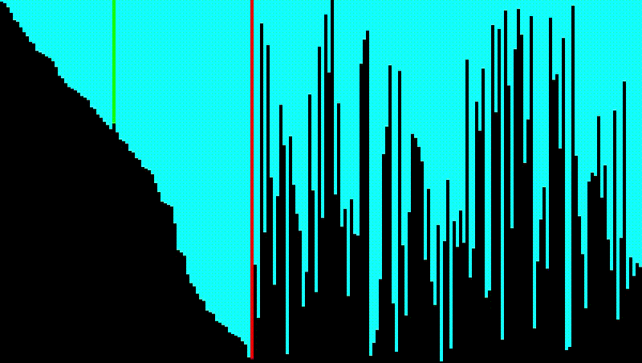

# Algorithm Visualizer in Java 

By @Alimov-8👨🏻‍💻 and @Rustam-Z👨🏼‍💻 

Updated: December 13, 2020

- Sorting Algorithms Visualizer
- Picture Puzzle Sorter `TODO`
- Pathfinding algorithm `TODO`

## First Prototype

## Skills Learned
- Multi-Threading using Swing Worker
- Customising Swing Components
- Graphics 2D
- Apply Sorting Algorithms

## References:
- https://clementmihailescu.github.io/Sorting-Visualizer/

- https://www.geeksforgeeks.org/java-swing-jmenubar/

- https://stackoverflow.com/questions/31094904/jmenu-not-appearing-until-window-is-resized

- https://stackoverflow.com/questions/4716372/java-how-do-i-close-a-jframe-while-opening-another-one

- https://www.youtube.com/watch?v=RxjXC1SM1A4

- https://stackoverflow.com/questions/4246351/creating-random-colour-in-java

- https://stackoverflow.com/questions/782265/how-do-i-use-swingworker-in-java

- https://docs.oracle.com/javase/tutorial/essential/concurrency/sleep.html

- https://stackoverflow.com/questions/1097366/java-swing-revalidate-vs-repaint

